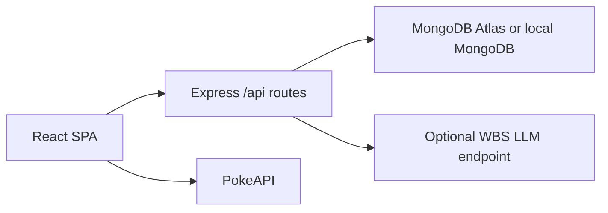

# Architecture

## Overview

The server is the production entry point. It serves `client/dist` for non-API routes and handles API requests under `/api`.

## Packages

- `client`: React/Vite app, browser routes, PokeAPI client, auth context, roster helpers, battle UI.
- `server`: Express API, Mongo connection, models, routes, middleware, optional AI recap service.

## Routes

- `GET /api/health`: status, timestamp, environment, Mongo state, and ping result.
- `POST /api/auth/register`: create user, hash password, return JWT and safe profile.
- `POST /api/auth/login`: verify credentials, return JWT and safe profile.
- `GET /api/leaderboard`: top 25 scores.
- `POST /api/leaderboard`: protected score creation.
- `POST /api/ai/battle-recap`: protected optional recap with deterministic fallback.
- Compatibility aliases: `/auth/register`, `/auth/login`, `GET /leaderboard`, `POST /leaderboard`.

## Data Models

`User`: email, passwordHash, displayName, timestamps.

`Score`: userId, score, wins, losses, team, opponent, timestamps.

## Auth Flow

The client stores the JWT in localStorage as required by the bootcamp brief. Protected client routes redirect anonymous users to `/login`. Protected API routes require `Authorization: Bearer <token>`. Tokens expire after two hours.

## Environment Flow

Development prefers `MONGODB_URI` and can fall back to `MONGODB_ATLAS_URI`. Production prefers Atlas. The server verifies an application collection read on startup because a database ping alone can pass even when collection reads are not authorized.
