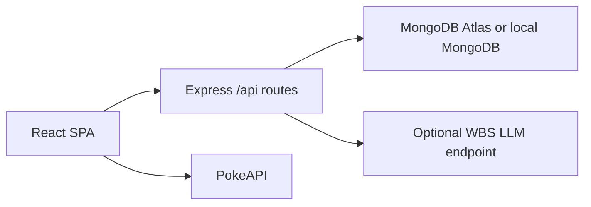

# Architecture

## Overview

The server is the production entry point. Express serves `client/dist` for browser routes and handles JSON routes under `/api`.

## Packages

- `client`: React/Vite app, browser routes, PokeAPI client, auth context, roster helpers, React Three Fiber battle arena, battle UI, and responsive CSS.
- `server`: Express API, Mongo connection, models, routes, middleware, validation, rate limits, and optional battle recap fallback.

## Browser Routes

- `/`: Pokedex dashboard and roster entry point.
- `/pokemon/:id`: detail page with artwork, type badges, stats, and abilities.
- `/roster`: local roster management.
- `/battle`: guest-friendly battle arena with solo practice, same-computer friend play, and web friend rooms. Authenticated solo battles can save verified scores.
- `/leaderboard`: public trophy leaderboard page.
- `/playbook`: kid-friendly game rules.
- `/login` and `/register`: trainer auth.

## API Routes

- `GET /api/health`: status, timestamp, environment, Mongo state, and ping result.
- `POST /api/auth/register`: create user, hash password, return JWT and safe profile.
- `POST /api/auth/login`: verify credentials, return JWT and safe profile.
- `POST /api/battles/start`: protected battle creation; validates the roster, fetches server-side Pokemon details, chooses an opponent, and returns a signed battle token.
- `POST /api/friend-battles`: create a short-lived, unscored friend room.
- `GET /api/friend-battles/:code`: read a friend room for polling.
- `POST /api/friend-battles/:code/join`: join a friend room as the second trainer.
- `POST /api/friend-battles/:code/move`: submit a friend-room move. These rooms are not written to the leaderboard.
- `GET /api/leaderboard`: top 25 scores.
- `POST /api/leaderboard`: protected score creation from a signed battle token and validated move list.
- `POST /api/ai/battle-recap`: protected optional recap with deterministic fallback; accepts the same verified battle submission shape.

Compatibility aliases remain for `/auth/register`, `/auth/login`, and non-browser JSON requests to `/leaderboard`. Browser navigation to `/leaderboard` serves the React page.

## Data Models

`User`: email, passwordHash, displayName, timestamps.

`Score`: userId, score, wins, losses, team, opponent, timestamps.

Leaderboard responses return display names, scores, teams, opponents, and timestamps. They do not expose user email addresses. Public leaderboard reads filter out unverifiable legacy rows outside the server-computable score range.

## Auth Flow

The client stores the JWT in localStorage because the bootcamp brief requires browser JWT persistence. Roster and practice/friend battles work as a guest. Protected API routes require `Authorization: Bearer <token>`. Tokens expire after two hours. New auth responses store only the user id and display name in the browser payload.

## Battle Integrity

The browser no longer submits final score fields directly. Battle start is server-mediated:

1. The client submits `playerId` and up to six roster ids to `POST /api/battles/start`.
2. The server validates first-generation Pokemon ids, fetches PokeAPI details, chooses the opponent, and signs a short-lived battle token bound to the authenticated user.
3. On completion, the client submits only the battle token and the selected move list.
4. The server verifies the token, replays the simple battle rules, and writes the derived score/win/loss/team/opponent values.

Friend battles deliberately do not use this scoring path. They are short-lived in-memory rooms for easy play on the same deployed app, with no persistent score write and no public leaderboard effect.

## Environment Flow

Development prefers `MONGODB_URI` and can fall back to `MONGODB_ATLAS_URI`. Production prefers Atlas. The server verifies an application collection read on startup because a database ping alone can pass even when collection reads are not authorized.

## Security Posture

Express uses Helmet with a CSP that allows the app shell, same-origin API calls, PokeAPI fetches, and PokeAPI official artwork from `raw.githubusercontent.com`. Request bodies are limited to 100 KB. Auth, score posting, and AI recap routes are rate-limited.
