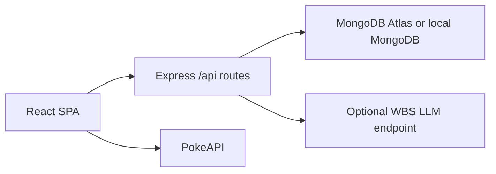

# Architecture

## Overview

The server is the production entry point. Express serves `client/dist` for browser routes and handles JSON routes under `/api`.

## Packages

- `client`: React/Vite app, browser routes, PokeAPI client, auth context, roster helpers, battle UI, and responsive CSS.
- `server`: Express API, Mongo connection, models, routes, middleware, validation, rate limits, and optional battle recap fallback.

## Browser Routes

- `/`: Pokedex dashboard and roster entry point.
- `/pokemon/:id`: detail page with artwork, type badges, stats, and abilities.
- `/roster`: protected roster management.
- `/battle`: protected turn-based battle arena.
- `/leaderboard`: public leaderboard page.
- `/playbook`: game rules and scoring explanation.
- `/login` and `/register`: trainer auth.

## API Routes

- `GET /api/health`: status, timestamp, environment, Mongo state, and ping result.
- `POST /api/auth/register`: create user, hash password, return JWT and safe profile.
- `POST /api/auth/login`: verify credentials, return JWT and safe profile.
- `GET /api/leaderboard`: top 25 scores.
- `POST /api/leaderboard`: protected score creation.
- `POST /api/ai/battle-recap`: protected optional recap with deterministic fallback.

Compatibility aliases remain for `/auth/register`, `/auth/login`, and non-browser JSON requests to `/leaderboard`. Browser navigation to `/leaderboard` serves the React page.

## Data Models

`User`: email, passwordHash, displayName, timestamps.

`Score`: userId, score, wins, losses, team, opponent, timestamps.

Leaderboard responses return display names, scores, teams, opponents, and timestamps. They do not expose user email addresses.

## Auth Flow

The client stores the JWT in localStorage because the bootcamp brief requires browser JWT persistence. Protected client routes redirect anonymous users to `/login`. Protected API routes require `Authorization: Bearer <token>`. Tokens expire after two hours.

## Environment Flow

Development prefers `MONGODB_URI` and can fall back to `MONGODB_ATLAS_URI`. Production prefers Atlas. The server verifies an application collection read on startup because a database ping alone can pass even when collection reads are not authorized.

## Security Posture

Express uses Helmet with a CSP that allows the app shell, same-origin API calls, PokeAPI fetches, and PokeAPI official artwork from `raw.githubusercontent.com`. Request bodies are limited to 100 KB. Auth, score posting, and AI recap routes are rate-limited.
