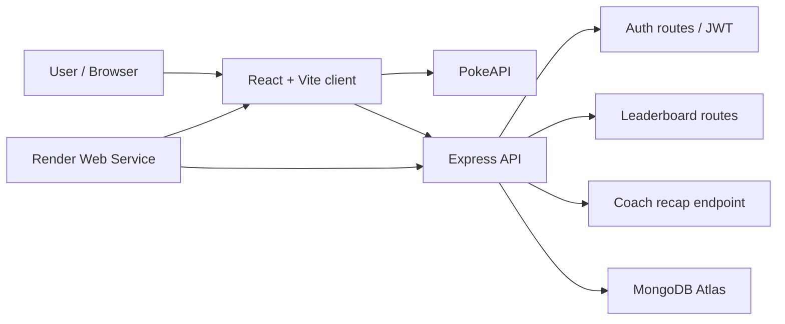
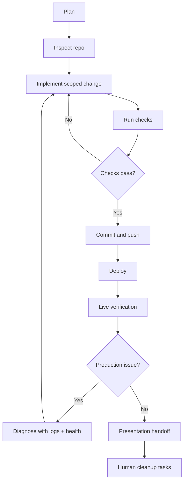

# WBS Presentation: Pokemon Battle Agent Workflow

Audience: WBS project group  
Length: 8-12 minutes  
Presenter goal: explain the product, the collaboration process, the build decisions, and how the post-deploy agent workflow can be formalized with the Vercel AI SDK.

## Slide 1: Title

**Pokemon Battle: From Plan To Live App**

Speaker notes:

- This project was not only about building a Pokemon battle app.
- It was also a controlled experiment in human-agent collaboration: planning, steering, implementation, verification, deployment, and post-deploy reflection.
- Final app: `https://pokemon-battle-ffwr.onrender.com`

## Slide 2: What We Built

**A full-stack Pokemon battle app**

- React/Vite frontend with a retro Pokedex/Game Boy style.
- Express/TypeScript backend.
- MongoDB leaderboard.
- JWT auth with bcrypt password hashing.
- PokeAPI browsing and Pokemon detail pages.
- Local roster management.
- Turn-by-turn battle arena.
- Server-side coach recap with deterministic fallback.
- Render deployment with live health checks.

Speaker notes:

- The app works as a single repository with `client` and `server` workspaces.
- The browser talks to same-origin `/api` routes served by Express.
- The deployed service also serves the Vite production build.

## Slide 3: Architecture

Speaker notes:

- One Render service hosts both the API and the built client.
- MongoDB Atlas stores users and leaderboard scores.
- The LLM-related endpoint stays server-side so keys are never exposed to the client.

## Slide 4: The Agent Workflow We Used

**The work moved through evidence gates**

1. Read project instructions and execution plan.
2. Confirm local environment and credentials without printing secrets.
3. Build backend.
4. Build frontend.
5. Verify locally with build, typecheck, lint, audit, health, and browser flow.
6. Commit and push.
7. Deploy with Render API.
8. Verify live app and `/api/health`.
9. Fix production issues.
10. Improve UX based on demo-readiness feedback.

Speaker notes:

- The important part is that the agent did not just generate code.
- Each phase had observable evidence: commands, health checks, screenshots, commits, deploy IDs, and notes in `docs/IMPLEMENTATION_LOG.md`.

## Slide 5: Human Steering Was Not Just Preference

**Private notes recorded 58 meaningful steering interventions**

- Session 1: 18
- Session 2: 18
- Session 3: 16
- Session 4: 6

**Actual build decisions extracted from those notes: 25**

Speaker notes:

- I separated build decisions from style preferences, simple confirmations, and emotional reactions.
- A build decision changed architecture, deployment, security posture, verification scope, implementation priority, or demo behavior.

## Slide 6: Build Decisions We Made Together

**Architecture and repo decisions**

1. Use one private full-stack repository instead of multiple public repositories.
2. Keep the project private on GitHub.
3. Use npm workspaces with `client` and `server`.
4. Serve the production React build from Express.
5. Keep auth behavior in backend routes for the MVP, then plan a later auth-server split.
6. Treat the stricter auth-service interpretation as future planned work, not a rushed rescue change.

Speaker notes:

- These were not cosmetic choices. They shaped how the app could be built, deployed, and presented.

## Slide 7: Deployment And Infrastructure Decisions

1. Deploy to Render instead of GitHub Pages because the app needs an Express backend.
2. Use MongoDB Atlas for production because Render cannot use a database on my local machine.
3. Delay Render service creation until package scripts existed, after Render initially guessed the project was Rust.
4. Use the Render API key for autonomous deployment instead of relying only on dashboard clicks.
5. Use Render health check path `/api/health`.
6. Change Render build command to install dev dependencies for TypeScript/Vite build.
7. Fix SPA fallback after the first live root page returned 404.

Speaker notes:

- Deployment decisions were a major part of the project.
- The workflow caught build-time and runtime differences between local and production.

## Slide 8: Security And Secrets Decisions

1. Never commit `.env` or secret values.
2. Store JWT in browser storage because the school requirement expected token storage, while documenting the tradeoff.
3. Keep AI/LLM keys server-side only.
4. Use temporary Atlas `0.0.0.0/0` only for the autonomous demo deployment.
5. Replace broad Atlas access with Render outbound CIDR allowlisting after deployment.
6. Avoid broad GitHub MCP permissions; use narrow/public-only access for open-source research.

Speaker notes:

- The Atlas network-access issue is a good example of real production debugging.
- Local database success did not guarantee Render could connect.

## Slide 9: UX And Demo Decisions

1. Do open-source UX/code-reference research before final styling.
2. Reject the first generic UI as not demo-ready.
3. Move to a retro Pokedex/Game Boy visual direction.
4. Add an in-app playbook/rules page.
5. Add load-more browsing so the dashboard did not feel capped.
6. Add detail-page navigation.
7. Add a visible roster counter.
8. Replace one-click simulation with an interactive turn-by-turn battle arena.
9. Show a visible server-side coach recap after battle.

Speaker notes:

- Some of these sound like design, but they changed what the product actually does during a demo.
- The battle arena decision especially changed the app from a simulation result into a playable experience.

## Slide 10: What Failed And What We Learned

**Production surfaced problems local checks did not**

- Local MongoDB ping could pass while collection reads failed.
- Render build failed when dev dependencies were omitted.
- Live root route returned 404 before SPA fallback was fixed.
- Auth later failed when the temporary Atlas allowlist was removed.
- The first UI was technically functional but not presentation-ready.

Speaker notes:

- The workflow worked because failures became evidence.
- Each failure produced a small fix, a rerun of checks, and a log entry.

## Slide 11: Post-Deploy Agent Workflow With Vercel AI SDK

**The next layer is to formalize this process as an agent workflow**

Core idea:

- Use Vercel AI SDK for model calls, tool definitions, schema validation, and multi-step loops.
- Represent repo checks, deploy checks, screenshots, and human gates as tools.
- Store each step as structured evidence.
- Stop at explicit gates: secrets, paid plans, destructive git actions, or security-sensitive infrastructure changes.

Speaker notes:

- The Pokemon app itself is on Render.
- The post-deploy workflow can still be described or prototyped using Vercel AI SDK concepts because the SDK is about agent orchestration, tools, and step evidence.

## Slide 12: Workflow Model

Speaker notes:

- This is the workflow I can present as the collaboration model.
- The loop is not random: it is bounded by checks, evidence, and stop conditions.

## Slide 13: Vercel AI SDK Shape

**The workflow becomes tools + steps**

Tools:

- `inspectRepo`
- `runCommand`
- `readImplementationLog`
- `summarizeSteeringDecisions`
- `checkHealthEndpoint`
- `recordEvidence`
- `requestHumanDecision`

AI SDK concepts:

- `generateText` for planning/summarizing.
- `tool` with Zod schemas for safe tool inputs.
- `stopWhen` / step limits for bounded multi-step execution.
- `steps` output as the audit trail for the presentation.

Speaker notes:

- The value is not "AI magic." The value is turning the agent run into inspectable structured steps.
- That is what makes the workflow presentable and reviewable.

## Slide 14: Why This Was A Collaboration

**The agent executed; the human set the risk boundaries**

- Human steering chose repo shape, privacy, deployment target, security posture, UX quality bar, and demo priorities.
- The agent handled implementation, checks, documentation, deployment calls, diagnosis, and iteration.
- The strongest result came from combining autonomy with explicit checkpoints.

Speaker notes:

- The agent was useful because it could carry a lot of operational detail.
- The human was necessary because many decisions were value/risk decisions, not just coding tasks.

## Slide 15: Demo Flow

**Recommended live demo**

1. Open the deployed app.
2. Show dashboard and roster counter.
3. Search/load more Pokemon.
4. Open a Pokemon detail page and navigate back.
5. Add Pokemon to roster.
6. Start a battle.
7. Use Strike, Guard, and Focus.
8. Show battle log, HP bars, score, and coach recap.
9. Open leaderboard.
10. Mention `/api/health` as production verification.

Speaker notes:

- Keep the demo focused on user-visible proof.
- Mention the workflow evidence after showing the product, not before.

## Slide 16: Closing

**Main takeaway**

This project shows a practical human-agent workflow:

- Plan in durable repo docs.
- Make build decisions explicit.
- Let the agent implement and verify.
- Keep the human in control of risk.
- Turn failures into evidence.
- Ship a working app and a repeatable process.

Speaker notes:

- The app is the artifact.
- The documented workflow is the transferable lesson.

